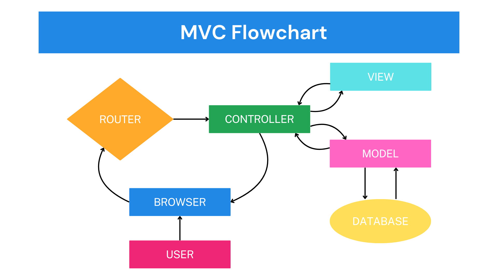

# MVC-Lecture
An easy-to-understand lecture on what MVC does and its' importance.

## What is MVC?
MVC is an architectural pattern that separates an application or a website's structure into three components - the Model, the View, and the Controller. Each component's place in the acronym has no significant order of importance.

## Why is it important?
Using MVC fully utilizes our separation of concerns. It organizes code to make the structure more readable and creates a modular framework. This also creates an environment for easier collaboration, allowing several programmers to work on different parts of the app simultaneously.

## Flowchart

### Model
Contains the only components that can directly access and process information from the database.

### View
Contains the only components that directly interact with the user a.k.a what's visible in the browser. It's the only thing the user can see.

### Controller
Acts as the middle man between Model and View. It contains instructions on how information received from the user needs to be processed and talks to any relevant component to make any changes. For example:

-If information from database needs to be retrieved or modified
 -Controller will talk to the Model then the Model processes information from Database

 -If there's new information that needs to be reflected in the browser
  -Controller instructs the View on how to display any new information and V

## Conclusion
The MVC is an important tool used by developers for organization and collaboration. It breaks down complex codebases into easier-to-read parts and takes advantage of modularity making for a more scaleable and user-friendly application.